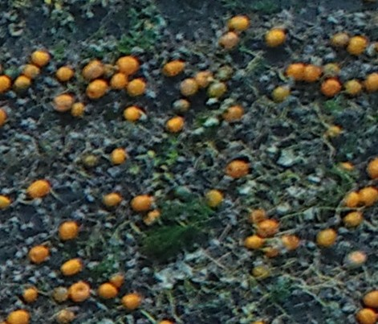
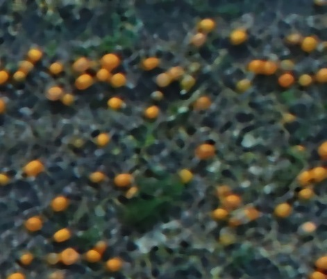

Exercise 4
__________

Slight natural variations in color can cause big differences in the performance of our detection.
In order to get a more consistent look on the pumpkins we used a blurring algorithm.
Our choice of algorithm is median blur. It performs nicely in terms of smoothing while also keeping hard contours.

Here is a showcase of the filter in action. Original (left) and filtered (right). The filter kernel size is set to 9 pixels.

